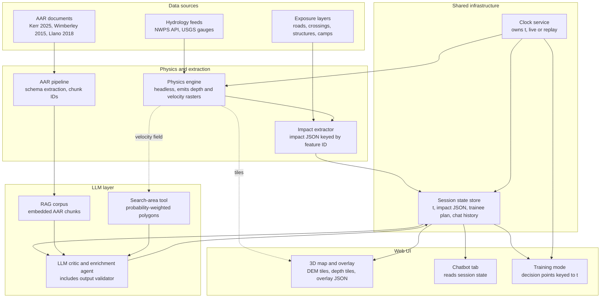

# Flood digital twin with outcome-grounded tactical critic

Architecture document, dnhacks, September 2026. Scope is flood only. Reference scenario is the Guadalupe River flash flood of 4 July 2025 in Kerr County, Texas.

## 1. Problem statement

Kerr County's failure was a decision-latency failure, not a data failure. A flood watch was issued at 1:18 p.m., a flash flood warning at 1:14 a.m., and a flash flood emergency at 4:03 a.m. Gauge data, radar-estimated rainfall, a county hazard mitigation plan that rated a flood event likely within a year, and an emergency operations plan that prescribed reconnaissance of known trouble spots after a watch all existed. Nobody synthesised them into "issue IPAWS and evacuate the riverfront camps" during the 2 hours 49 minutes between the warning and the emergency. Nearly 200 people died.

The product addresses that gap in two settings where a human commander still owns every operational decision:

1. Training: a trainee runs the Kerr County timeline, makes tactical choices at fixed decision points, and is critiqued against what those choices cost in comparable historical incidents.
2. Live rescue: during an active flood response, an incident commander or EOC staff uses the live twin (real-time inundation + cited AAR critique) to stress-test proposed tactics against projected inundation and historical outcomes while the operation is underway.

It is decision support, not autonomous dispatch — the system critiques and synthesizes; a human commander issues every operational order. That boundary is what keeps it buildable, defensible, and usable by a rural county tomorrow.

## 2. What exists and what does not

| Category | Examples | What it does | What it lacks |
|---|---|---|---|
| IAP and command software | The Response Group IAP Software, Tablet Command, Adashi C&C, Metric IAP, First Due | Records the tactics a human chose, fills ICS forms, tracks resources | Does not propose tactics, does not know historical outcomes |
| Exercise management | Avalanche TTX, TabletopOne | Generates scenarios and injects, logs decisions, produces HSEEP reports | Does not grade tactics against history |
| Plan generation | DisasterResponseGPT (research paper, 2023), AlertMedia AI Plan Builder (August 2026) | Generates courses of action from doctrine | Not productised for responders (DRGPT) or grounded in doctrine only (AlertMedia) |
| Doctrine-grounded COA agents | Leidos and NVIDIA C2AI (in development) | Recommends courses of action from FEMA and agency doctrine | Prime-contractor prototype, doctrine not outcomes |
| Inundation prediction | NOAA National Water Model, NWS Flood Inundation Mapping | Real-time and forecast street-level inundation nationwide | Not integrated with tactics or training |

Nobody ships a usable tool that critiques tactics against historical outcomes. That is the one-sentence differentiator.

## 3. Design principles

1. Physics does physics, the LLM does tactics. Neither is asked to do the other's job.
2. Nothing is trained. Inundation comes from government hydrology models; tactics critique comes from retrieval over a structured AAR corpus. "Grounded in" is the verb, never "trained on".
3. Every LLM claim cites either an AAR chunk ID or a twin feature ID. Outputs that cite non-existent IDs are rejected.
4. One clock. Every component reads simulation time from a single service.
5. Contracts before code. Four JSON contracts are agreed and stubbed before any layer is optimised.

## 4. Architecture

Solid arrows are the primary data path. Dashed arrows are direct reads that bypass the LLM (tiles to the map, velocity to the search-area tool).

## 5. Components

### 5.1 Data sources

Hydrology feeds. NOAA National Water Prediction Service API for National Water Model analysis and forecast streamflow per reach. USGS Water Services API for the Guadalupe at Hunt, Kerrville, and Comfort (stage and discharge at 15-minute resolution). Two modes: the July 2025 archive for replay, the live feed for real-time mode.

Terrain. USGS 3DEP 1 m lidar DEM for Kerr County, Hunt through Kerrville to Comfort, via the National Map or the AWS 3DEP bucket.

Inundation method. HAND (Height Above Nearest Drainage) rasters and synthetic rating curves for the relevant HUC8, published by UT Austin and NOAA OWP. Where the reach is covered, NWS FIM outputs can be pulled directly from the NWPS API as a cross-check.

Exposure layers. TxDOT road centerlines, Kerr County low-water crossings, NHD flowlines, OpenStreetMap building footprints, camp footprints along the Guadalupe. Every feature receives a stable feature ID at ingest.

AAR corpus. Texas House and Senate joint committee testimony and reports on the July 2025 flood, the Kerr County 2024 hazard mitigation plan and emergency operations plan, the NWS service assessment, the USGS post-flood report, FEMA IPAWS records, and two or three additional Texas flash flood AARs (Wimberley 2015, Houston 2016, Llano 2018) for retrieval breadth.

### 5.2 Clock service

Owns simulation time t and the mode (live or replay). Replay streams the July 2025 timeline at adjustable speed. Every component that has a notion of "now" reads t from this service and nowhere else. Without it the map, the overlay, the chatbot, and the search-area tool would each describe a different moment.

### 5.3 Physics engine

Headless. Inputs are DEM, HAND raster, rating curves, and streamflow per reach at t. Outputs are a depth raster and a velocity raster per timestep, written as GeoTIFF or tiles. Rendering is not in this component; keeping it headless allows batch replay and tool calls without a GPU renderer in the loop.

Depth: flow to stage via the synthetic rating curve, stage minus HAND per cell.

Velocity: HAND provides depth only. A Manning-style proxy from local slope, depth, and roughness gives a usable velocity field for the search-area tool. This is explicitly a proxy and is labelled as such in outputs.

Known limits, stated in the demo: HAND underpredicts on fourth-order and smaller streams, is sensitive to the roughness coefficient, and fails when NWM streamflow is badly biased. The Guadalupe main stem is large enough for the method; the tributary creeks that hit the camps are borderline. Lead time for this flood type is minutes to a few hours of inundation ahead driven by observed upstream flow, not a forecast made the afternoon before.

Stretch goal, not foundation: a residual correction model learned from historical FIM output versus observed high-water marks and satellite inundation in the same basin. This is the only place learned prediction belongs.

### 5.4 Impact extractor

The interface between the twin and the LLM. Intersects the depth and velocity rasters with the exposure layers and emits impact JSON per timestep. The LLM never sees a raster; it sees this document. All geometry is referenced by feature ID so the LLM cannot invent coordinates.

Output per timestep includes: impassable crossings now, crossings projected impassable at t+30, t+60, t+120 minutes; threatened structures with depth; camp egress routes and the time at which each goes under; reach-level stage and rate of rise.

### 5.5 AAR pipeline and RAG corpus

Parses each AAR into a common schema: hazard, phase, tactic tried, resources, outcome, lesson, source citation with page or paragraph. Each record receives a chunk ID. Records are embedded and stored. Retrieval is by hazard, phase, and semantic similarity to the current impact JSON and the user's proposed plan.

This is a workload item, not an assumption. It competes for the same teammate's time as the search-area tool.

### 5.6 Search-area tool

Reframed from "predicted missing-person coordinates" to search-area prioritisation. Inputs are last-known positions (from call data in the scenario), the velocity proxy, and the depth raster. Output is probability-weighted downstream polygons with explicit uncertainty, never a point. Land-search behaviour models (ISRID) do not transfer to swiftwater, and a tool that returns a coordinate for a specific person is the output a judge with SAR experience will attack.

### 5.7 LLM layer

Two roles sharing one session state: an enrichment agent that produces overlay JSON for the map, and a chat agent for the chatbot tab. Both receive the current t, the current impact JSON, the trainee's plan, and prior turns.

Tools: impact extractor (query by feature or area at t), RAG corpus (retrieve by hazard, phase, similarity), search-area tool.

Critic behaviour: given the trainee's proposed tactics at a decision point, retrieve the closest historical incidents and their AARs, check the proposal against what worked and failed there, and return specific objections and alternatives. Every objection cites a chunk ID or a feature ID.

Validator: a post-processing step that rejects any output referencing a chunk ID or feature ID not present in the corpus or the current impact JSON. Rejected outputs are regenerated, not passed through.

### 5.8 Session state store

Single source of truth for t, the current impact JSON, the trainee's plan, LLM outputs, and chat history. The enrichment agent, the chatbot, the map overlay, and training mode all read from it. This is what keeps the chatbot from contradicting the overlay.

### 5.9 Web UI

3D map: DEM draped with the depth layer, timeline scrubber bound to the clock, live or replay toggle, overlay JSON rendered as markers and polygons keyed by feature ID. CesiumJS or deck.gl TerrainLayer.

Chatbot tab: conversational access to the same session state and tools.

Training mode: decision points keyed to t (1:14 a.m., 2:30 a.m., 4:03 a.m. in the Kerr County replay). At each point the trainee enters a plan; the critic responds with cited objections and the cost of comparable choices in 2025.

## 6. Contracts

Agree these first. Stub each with canned Kerr County data and get the UI rendering end to end before any layer is optimised.

1. Engine to extractor: raster format (GeoTIFF, CRS, resolution), depth and velocity bands, timestep t, reach IDs.
2. Extractor to LLM: impact JSON schema with feature IDs, projected horizons, and stage metrics.
3. LLM to UI: overlay JSON schema referencing feature IDs only, with type (marker, polygon, timed event), severity, citation IDs, and the t it applies to.
4. Session state schema: t, mode, impact JSON, plan, LLM outputs, chat history, decision-point status.

## 7. Demo script

Kerr County replay, 4 July 2025.

1. 1:18 p.m. flood watch. Map shows dry terrain, gauges normal. Training mode presents the county plan's reconnaissance step.
2. 1:14 a.m. flash flood warning. Trainee proposes tactics. Critic cites the plan's unexecuted reconnaissance step and the 2024 hazard plan's risk rating.
3. 2:30 a.m. Gauge at Hunt rising fast. Impact extractor flags camp egress roads going under within 30 minutes. Trainee proposes alert method. Critic contrasts CodeRed opt-in reach with IPAWS and cites the 2025 outcome.
4. 4:03 a.m. flash flood emergency. Search-area tool produces downstream polygons from scripted last-known positions.
5. After-action: session state exported as a decision log with every critique and citation.

## 8. Cut list

If time runs short, in order: drop live mode (replay only); drop the 3D viewer for a 2D depth map; drop the residual correction model; reduce the corpus to the Kerr County documents alone.

## 9. Team allocation

Three people, five subsystems plus a UI. Suggested split: one on physics engine and impact extractor, one on AAR pipeline, RAG corpus, and search-area tool, one on clock, session state, LLM layer, and web UI. Contracts are written jointly in the first hour.
